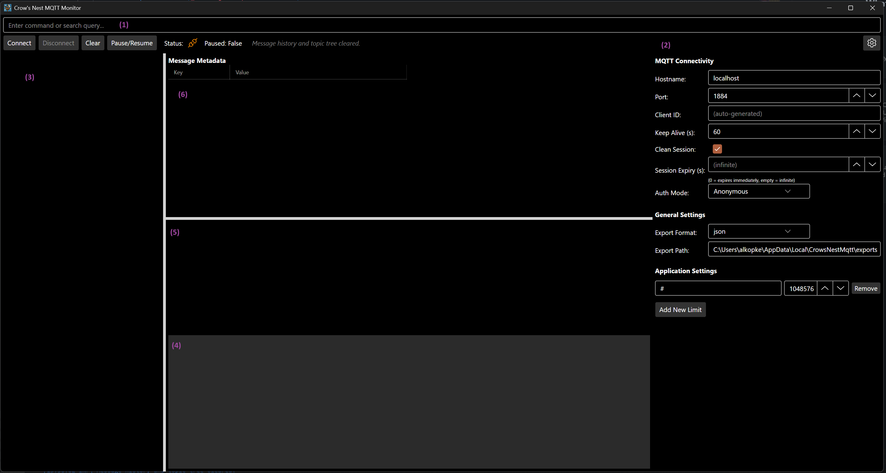

# Crow's NestMQTT

**Crow’s NestMQTT** is a versatile, cross-platform MQTT GUI client designed to simplify and enhance your messaging experience across Linux, Windows, and macOS. With an intuitive, polished interface, it serves as your lookout—monitoring, managing, and troubleshooting MQTT communications with precision and ease.

Whether you're a seasoned developer or a newcomer to IoT, Crow’s NestMQTT provides robust tools for subscribing to topics, and inspecting payloads in real time. The client offers customizable dashboards, seamless connection management, and advanced filtering options, ensuring you can quickly pinpoint critical data streams. Its cross-platform support means that no matter your operating system, you can harness the power of MQTT to orchestrate reliable and secure message flows. Welcome aboard, and let Crow’s NestMQTT guide you through the vast network of your IoT environment!

## Graphical User Interface



The Crow’s NestMQTT graphical interface is organized into several key areas:

**1. Command Plate**
Used to execute commands, as Crow's NestMQTT is designed for developer this is the main interaction mode. For list and description of available commands see [Command Interface section](#command-interface). 

Command Plate can be selected by `Ctrl + Shift + P` keyboard shortcut.

**2. Settings Pane**
Used to configure Crow'S NestMQTT, can be opened/closed by clicking on `Gear` button or using :settings command.

**3. MQTT Topic Tree**
Used to show MQTT topics, where messages are received. Selecting a topic here will set the context for the other panes.

**4. History View**
Shows the history of received messages of the selected topic. Including the received time, the size, a small preview and the possibility to copy the whole message. Selecting a message here will set the context for details and metadata panes.

**5. Payload View**
Shows the payload of the message selected in history view. Supports rendering of JSON payload or shows payload as text. The default viewer is depending on `contentType` of the selected Message. The viewer can be switched by using `:view raw` and `:view json` commands.

**6. Metadata View**
Shows all the metadata of the message selected in history view. Including standard metadata like `correlation-id`, `response-topic` but also custom metadata like `user-properties`. 

### Settings
**1. Connection Settings**  
Configure how the client connects to your MQTT broker:
- **Hostname**: The broker address (default: `localhost`).
- **Port**: The broker port (default: `1883`).
- **Use TLS**: Enable to connect to the broker using TLS encryption. If enabled, the client will allow untrusted certificates and ignore certificate chain and revocation errors. You can also set this via the `:setusetls <true|false>` command.
- **Client ID**: Optional identifier for the client. If left blank, one is generated.
- **Keep Alive Interval**: Time in seconds between keep-alive pings (default: `60`).
- **Clean Session**: If enabled, the broker does not retain session data after disconnect.
- **Session Expiry Interval**: How long (in seconds) the broker should retain session state after disconnect (if Clean Session is off).

**2. Authentication**  
Choose the authentication mode:
- **Anonymous**: No credentials required.
- **Username/Password**: Enter credentials for brokers requiring authentication.
- **Enhanced**: For MQTT 5.0 enhanced authentication, specify:
  - **Authentication Method** (e.g., `SCRAM-SHA-1`, `K8S-SAT`)
  - **Authentication Data** (method-specific data)

**3. Export Options**  
Control how and where message logs are exported:
- **Export Format**: Choose between JSON or plain text.
- **Export Path**: Directory for exported files.

**4. Topic Buffer Limits**  
Set per-topic message buffer limits to manage memory usage:
- **Topic Filter**: MQTT topic or wildcard (e.g., `#` for all topics).
- **Max Size (Bytes)**: Maximum buffer size for each topic.


## Command Interface

Crow's Nest MQTT provides a command interface (likely accessible via a dedicated input field) for quick actions. Commands are typically prefixed with a colon (`:`). You can quickly access this input field using the `Ctrl + Shift + P` keyboard shortcut.

*   `:connect [<server:port>] [<username>] [<password>]` - Connect to an MQTT broker. If arguments are omitted, connection details are loaded from settings.
*   `:disconnect` - Disconnect from the current MQTT broker.
*   `:export <json|txt> <filepath>` - Export messages to a file in JSON or plain text format. If arguments are omitted, the path and format are loaded from settings.
*   `:filter [regex_pattern]` - Filter messages based on a regex pattern. Clears the filter if no pattern is provided.
*   `:clear` - Clear all messages from the display.
*   `:help [command]` - Show information about available commands.
*   `:copy` - Copy the selected messages to the clipboard.
*   `:pause` - Pause the display of new messages.
*   `:resume` - Resume the display of new messages.
*   `:expand` - Expand all nodes in the topic tree.
*   `:collapse` - Collapse all nodes in the topic tree.
*   `:view <raw|json>` - Set the payload view to either raw text or a formatted JSON tree.
*   `:settings` - Toggle the visibility of the settings panel.
*   `:setuser <username>` - Set the username for MQTT authentication.
*   `:setpass <password>` - Set the password for MQTT authentication.
*   `:setauthmode <anonymous|userpass|enhanced>` - Set the authentication mode.
*   `:setauthmethod <method>` - Set the authentication method for enhanced authentication (e.g., `SCRAM-SHA-1`, `K8S-SAT`).
*   `:setauthdata <data>` - Set the authentication data for enhanced authentication (method-specific data).
*   `:setusetls <true|false>` - Set whether to use TLS for the MQTT connection. When set to `true`, the client will connect using TLS, allow untrusted certificates, and ignore certificate errors.
*   `[search_term]` - Any text entered without a `:` prefix is treated as a search term to filter messages.

## Enhanced Authentication

Crow's Nest MQTT supports Enhanced Authentication, as defined in the MQTT 5.0 specification. This allows for more advanced authentication mechanisms, such as Challenge/Response Authentication.

To use Enhanced Authentication, you need to configure the following settings:

*   **`AuthenticationMethod`**: The name of the authentication method (e.g., `SCRAM-SHA-1`, `K8S-SAT`).
*   **`AuthenticationData`**: The authentication data, which is specific to the chosen authentication method.

You can set the authentication mode to `enhanced` using the `:setauthmode` command:

```
:setauthmode enhanced
:setauthmethod ABC
:setauthdata CAFE
```

When connecting to a broker with Enhanced Authentication, the client and broker will exchange authentication data until the authentication process is complete.
