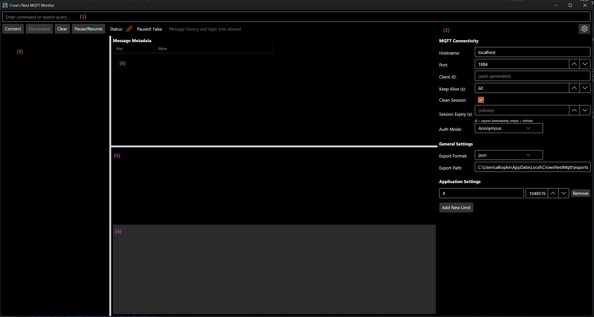
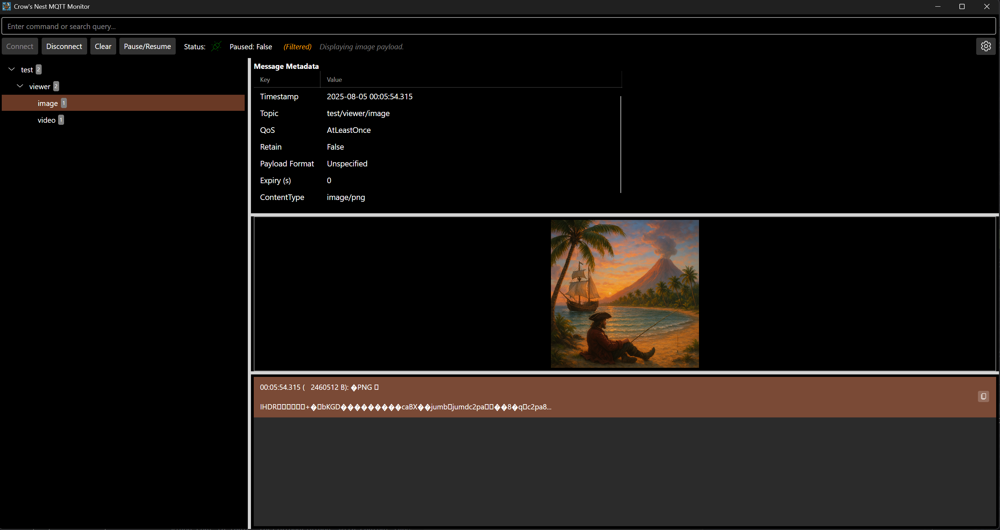
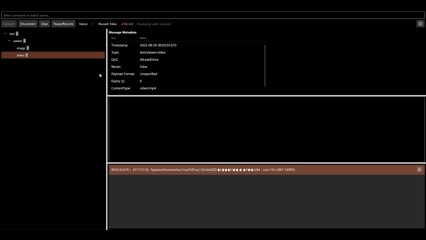
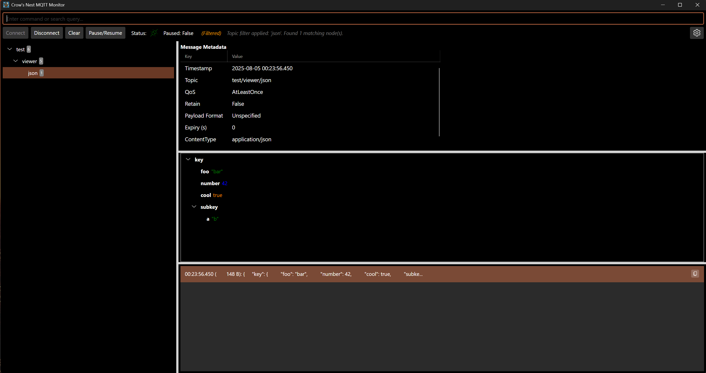
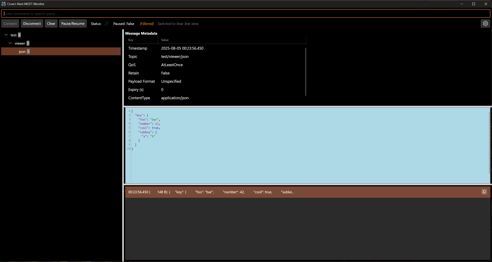
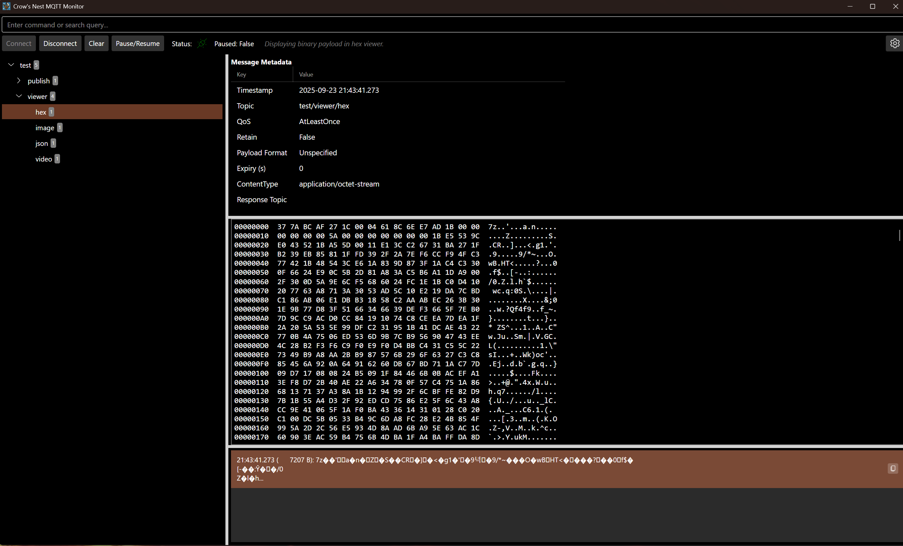
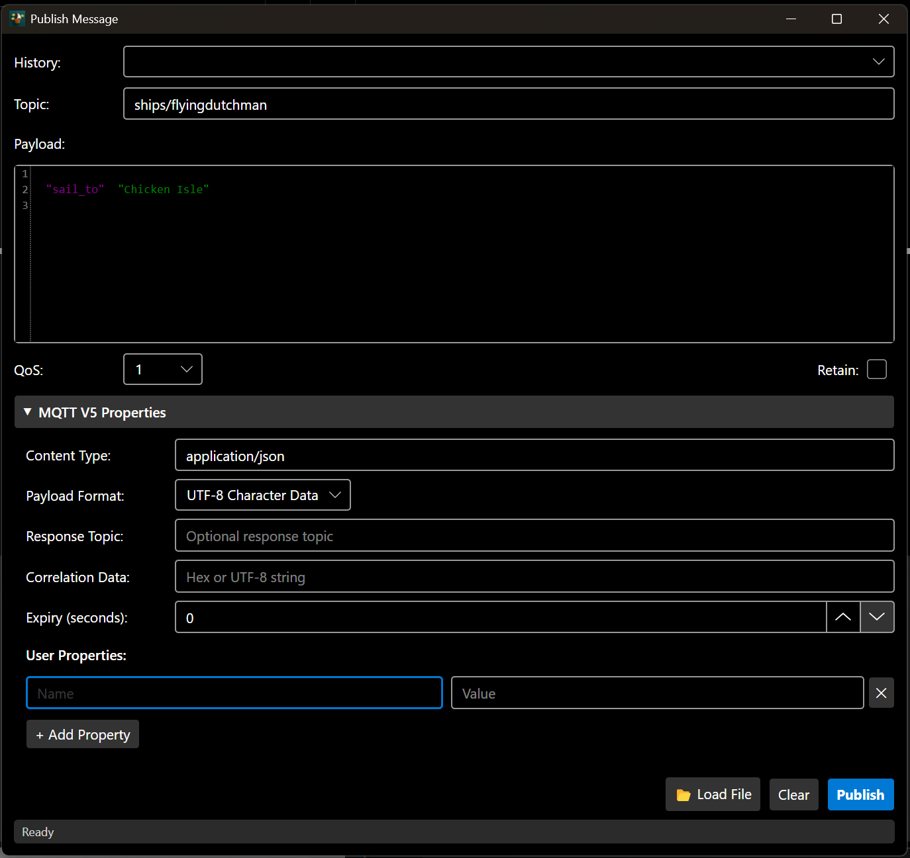
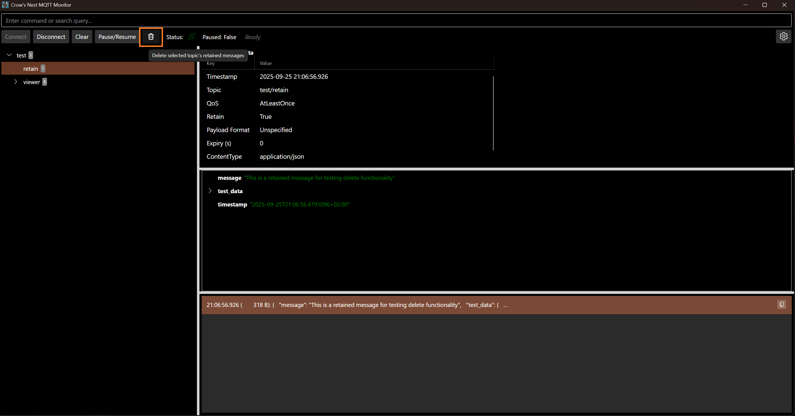
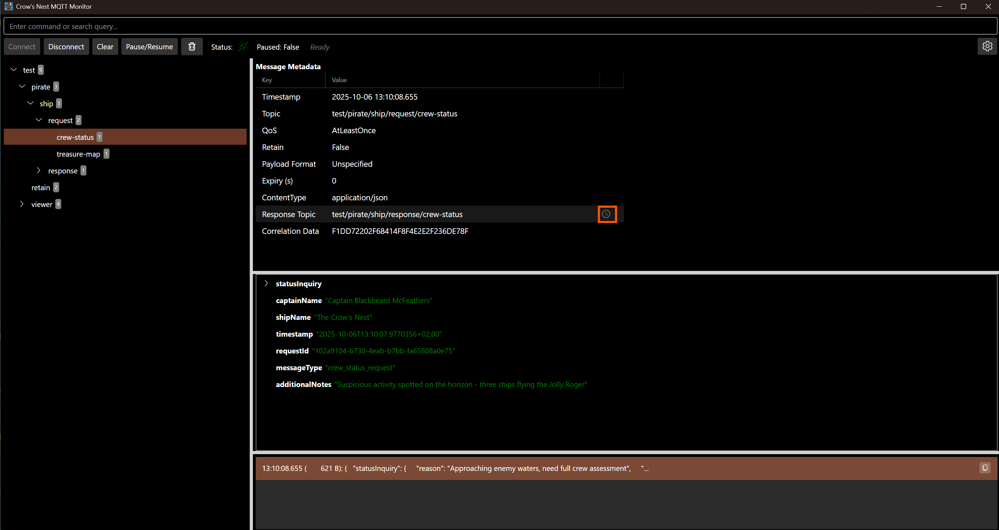
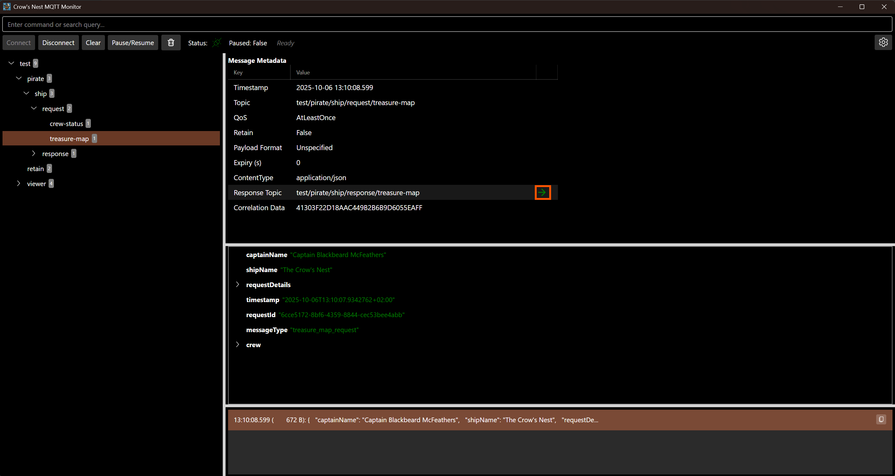

# Crow's NestMQTT

**Crow’s NestMQTT** is a versatile, cross-platform MQTT GUI client designed to simplify and enhance your messaging experience across Linux, Windows, and macOS. With an intuitive, polished interface, it serves as your lookout—monitoring, managing, and troubleshooting MQTT communications with precision and ease.

Whether you're a seasoned developer or a newcomer to IoT, Crow’s NestMQTT provides robust tools for subscribing to topics, and inspecting payloads in real time. The client offers customizable dashboards, seamless connection management, and advanced filtering options, ensuring you can quickly pinpoint critical data streams. Its cross-platform support means that no matter your operating system, you can harness the power of MQTT to orchestrate reliable and secure message flows. Welcome aboard, and let Crow’s NestMQTT guide you through the vast network of your IoT environment!

## Installation

### Microsoft Store (Recommended)
Install from the Microsoft Store for the simplest experience. Packages are automatically signed by Microsoft—no additional setup required.

### GitHub Releases (Sideloading)
Download the `.msixbundle` or platform-specific `.msix` from [GitHub Releases](https://github.com/koepalex/Crow-s-Nest-MQTT/releases). These packages are unsigned, so Windows requires **Developer Mode** to be enabled before installation:

1. Open **Settings → System → For developers**
2. Enable **Developer Mode**
3. Double-click the downloaded `.msixbundle` to install

Alternatively, install via PowerShell:
```powershell
Add-AppxPackage -Path .\CrowsNestMqtt-1.0.0.msixbundle
```

### Linux & macOS
Download the platform-specific archive or `.dmg` from [GitHub Releases](https://github.com/koepalex/Crow-s-Nest-MQTT/releases) and run the executable directly—no installation step required.

## Why using it?

* Focused on developer 💻
* Controllable via keyboard shortcuts ⌨️
  * Fast topic search with `/[term]` and navigate with `n`/`N`
  * Navigate message history with `j`/`k` (vim-style)
* MQTT V5 feature rich 📨
  * Shows more than only MQTT message payload
    * metadata like `response-topic`, `correlation-data`, `content-type`  etc.
    * all user properties
  * Supports MQTT V5 enhanced authentication
  * Visual indication of expired messages ⏰
    * Strikethrough and dimmed text in message history for expired messages
    * Yellow warning icon in metadata view for the expiry field
* Supports TLS connection to MQTT Broker 🔐
* Can handle huge amount of MQTT messages 
* Allows filtering of MQTT topics by pattern 🗃️
* Allows searching of pattern within MQTT message payloads 🔍
* Supports copy of MQTT message including metadata 
* Export of MQTT messages  
* `content-type` aware visual representation of MQTT message payload 
  * Json
  * Images
  * Video
  * Hex (for binary data)
* MQTT message publishing
* dotnet Aspire context aware

## Graphical User Interface



The Crow’s NestMQTT graphical interface is organized into several key areas:

**1. Command Plate**
Used to execute commands, as Crow's NestMQTT is designed for developer this is the main interaction mode. For list and description of available commands see [Command Interface section](#command-interface). 

Command Plate can be selected by `Ctrl + Shift + P` keyboard shortcut.

**2. Settings Pane**
Used to configure Crow'S NestMQTT, can be opened/closed by clicking on `Gear` button or using :settings command.

**3. MQTT Topic Tree**
Used to show MQTT topics, where messages are received. Selecting a topic here will set the context for the other panes.

**4. History View**
Shows the history of received messages of the selected topic. Including the received time, the size, a small preview and the possibility to copy the whole message. Selecting a message here will set the context for details and metadata panes.

**5. Payload View**
Shows the payload of the message selected in history view. Supports rendering of JSON payload or shows payload as text. The default viewer is depending on `content-type` of the selected Message. The viewer can be switched by using `:view raw`, `:view json` and `:view image` commands.

**6. Metadata View**
Shows all the metadata of the message selected in history view. Including standard metadata like `correlation-id`, `response-topic` but also custom metadata like `user-properties`. When a message has a non-zero `message-expiry-interval`, the metadata view shows the remaining time or "EXPIRED" status. Expired messages display a yellow warning icon next to the expiry field.

### Settings
**1. Connection Settings**  
Configure how the client connects to your MQTT broker:
- **Hostname**: The broker address (default: `localhost`).
- **Port**: The broker port (default: `1883`).
- **Use TLS**: Enable to connect to the broker using TLS encryption. If enabled, the client will allow untrusted certificates and ignore certificate chain and revocation errors. You can also set this via the `:setusetls <true|false>` command.
- **Client ID**: Optional identifier for the client. If left blank, one is generated.
- **Keep Alive Interval**: Time in seconds between keep-alive pings (default: `60`).
- **Clean Session**: If enabled, the broker does not retain session data after disconnect.
- **Session Expiry Interval**: How long (in seconds) the broker should retain session state after disconnect (if Clean Session is off).

**2. Authentication**  
Choose the authentication mode:
- **Anonymous**: No credentials required.
- **Username/Password**: Enter credentials for brokers requiring authentication.
- **Enhanced**: For MQTT 5.0 enhanced authentication, specify:
  - **Authentication Method** (e.g., `SCRAM-SHA-1`, `K8S-SAT`)
  - **Authentication Data** (method-specific data)

**3. Export Options**  
Control how and where message logs are exported:
- **Export Format**: Choose between JSON or plain text.
- **Export Path**: Directory for exported files.

**4. Topic Buffer Limits**  
Set per-topic message buffer limits to manage memory usage:
- **Topic Filter**: MQTT topic or wildcard (e.g., `#` for all topics).
- **Max Size (Bytes)**: Maximum buffer size for each topic.

### Viewers
Crow's NestMQTT automatically render content of MQTT message as image when the content-type indicates an image


or plays a video when the content-type indicates one  


or renders a JSON object when the content-type is set to `application/json`  


if the special viewer can't be applied the default content viewer is used  


If the content-type indicates binary data (but not image/video), Crow's NestMQTT will automatically show the payload in a read-only hex viewer:


You can switch between viewers for the currently selected MQTT message using the `:view` command.

### Publishing
Crow's NestMQTT allows publishing of MQTT messages, the publishing dialog (can be toggled via `Ctrl+Shift+M`) allows defining the payload, configuring message metadata as well as setting user-properties.  
You can also choose to select a file for publishing instead (which will fillout some metadata like content-type automatically). As pirates take everything and give nothing back, all send messages are stored locally to easily send them again.



### Other Features
Crow's NestMQTT has some advanced features to make the life of the pirate that sail on the MQTT bit sea easier such as.

Delete Topics allow remove retain messages from selected topics


Crow's NestMQTT understand MQTT V5 request/response, each request message shows a small clock icon while waiting for the related response message.


Once the response message is received (first message send to given response topic that has the same correlation data), and clickable arrow icon allows jumping direct to the response.


Messages with MQTT V5 `message-expiry-interval` are visually marked when they expire: the message history shows them with strikethrough text and dimmed foreground, while the metadata view displays a yellow warning triangle icon next to the expiry field with the "EXPIRED" status.

## Command Interface

Crow's Nest MQTT provides a command interface (likely accessible via a dedicated input field) for quick actions. Commands are typically prefixed with a colon (`:`). You can quickly access this input field using the `Ctrl + Shift + P` keyboard shortcut.

*   `:connect [<server:port>] [<username>] [<password>]` - Connect to an MQTT broker. If arguments are omitted, connection details are loaded from settings.
*   `:disconnect` - Disconnect from the current MQTT broker.
*   `:export <json|txt> <filepath>` - Export messages to a file in JSON or plain text format. If arguments are omitted, the path and format are loaded from settings.
*   `:export all` - Export all messages from the currently selected topic to a single JSON file in the configured export path. The file contains an array of all messages from that topic.
*   `:filter [regex_pattern]` - Filter messages based on a regex pattern. Clears the filter if no pattern is provided.
*   `/[search_term]` - Search for topics containing the search term (case-insensitive). Use `n` to navigate to the next match and `N` (Shift+n) to navigate to the previous match. The topic tree automatically expands to show the selected topic.
*   `:clear` - Clear all messages from the display.
*   `:help [command]` - Show information about available commands.
*   `:copy` - Copy the selected messages to the clipboard.
*   `:pause` - Pause the display of new messages.
*   `:resume` - Resume the display of new messages.
*   `:expand` - Expand all nodes in the topic tree.
*   `:collapse` - Collapse all nodes in the topic tree.
*   `:deletetopic [<topic>]` - Removes all retain messages to a given topic (and subtopics)
*   `:gotoresponse` - Navigate to the response message for the currently selected MQTT v5 request message (if a response has been received)
*   `:view <raw|json|image|video|hex>` - Set the payload view to raw text, formatted JSON tree, image, video, or hex viewer. The hex viewer displays binary payloads in a classic hex+ASCII table.
*   `:settings` - Toggle the visibility of the settings panel.
*   `:setuser <username>` - Set the username for MQTT authentication.
*   `:setpass <password>` - Set the password for MQTT authentication.
*   `:setauthmode <anonymous|userpass|enhanced>` - Set the authentication mode.
*   `:setauthmethod <method>` - Set the authentication method for enhanced authentication (e.g., `SCRAM-SHA-1`, `K8S-SAT`).
*   `:setauthdata <data>` - Set the authentication data for enhanced authentication (method-specific data).
*   `:setusetls <true|false>` - Set whether to use TLS for the MQTT connection. When set to `true`, the client will connect using TLS, allow untrusted certificates, and ignore certificate errors.
*   `:publish [topic] [@file|text]` - Open the publish window. Optionally pre-fill the topic (defaults to the selected topic) and payload from a file (`@path/to/file`) or inline text. The publish window is non-modal and supports all MQTT V5 properties.
*   `[search_term]` - Any text entered without a `:` prefix is treated as a search term to filter messages.

## Keyboard Navigation Shortcuts

Crow's NestMQTT provides vim-inspired keyboard shortcuts for efficient navigation without leaving the keyboard:

### Topic Search Navigation
*   **`/[search_term]`** - Search for topics containing the term (case-insensitive). Automatically selects the first match and expands the topic tree to show it.
*   **`n`** - Navigate to the next search result. Wraps around to the first match when reaching the end.
*   **`N`** (Shift+n) - Navigate to the previous search result. Wraps around to the last match when at the beginning.

The search status is displayed in the status bar showing the current match position (e.g., "Search: 'sensor' (match 2 of 5)").

### Message History Navigation
*   **`j`** - Move down to the next message in the history view. Wraps to the first message when at the end.
*   **`k`** - Move up to the previous message in the history view. Wraps to the last message when at the beginning.

### Other Shortcuts
*   **`Ctrl + Shift + P`** - Open the command palette to quickly access any command.
*   **`Ctrl + Shift + M`** - Toggle the publish window.
*   **`Alt + P`** - Send/publish message (when publish window is focused).
*   **`Ctrl + Enter`** - Alternative send shortcut (when publish window editor is focused).
*   **`Escape`** - Close the publish window.

**Note:** Keyboard shortcuts are automatically disabled when typing in the command palette to prevent interference with normal text input.

## Enhanced Authentication

Crow's Nest MQTT supports Enhanced Authentication, as defined in the MQTT 5.0 specification. This allows for more advanced authentication mechanisms, such as Challenge/Response Authentication.

To use Enhanced Authentication, you need to configure the following settings:

*   **`AuthenticationMethod`**: The name of the authentication method (e.g., `SCRAM-SHA-1`, `K8S-SAT`).
*   **`AuthenticationData`**: The authentication data, which is specific to the chosen authentication method.

You can set the authentication mode to `enhanced` using the `:setauthmode` command:

```
:setauthmode enhanced
:setauthmethod ABC
:setauthdata CAFE
```

When connecting to a broker with Enhanced Authentication, the client and broker will exchange authentication data until the authentication process is complete.

## dotnet Aspire

Crow's NestMQTT automatically connects to the MQTT Broker endpoint defined via dotnet Aspire environment variables. It supports both `services__mqtt__mqtt__0` and `services__mqtt__default__0` naming conventions. For example, the environment variable would contain a value like `mqtt://localhost:42069`.

When an Aspire endpoint environment variable is detected, the application:
1. Parses the hostname and port from the URI
2. Overrides the corresponding settings
3. Automatically connects to the broker on startup
4. Persists the overridden values to `settings.json` so other tools can use them

```csharp
  // ...
  var mqttViewerWorkingDirectory = @"S:\upertools\CrowsNestMqtt";
  builder
      .AddExecutable("mqtt-client", Path.Combine(mqttViewerWorkingDirectory, "CrowsNestMqtt.App.exe"), mqttViewerWorkingDirectory)
      .WithReference(mqttBrokerEndpoint)
      .WaitFor(mqttBroker);
```

## Environment Variable Configuration

All settings can be configured via environment variables using the `CROWSNEST__` prefix. When environment variable overrides are detected, they are applied on top of file-based settings and **persisted to `settings.json`** so other tools (e.g., `SendTestData.ps1`) can use the same configuration.

This is useful for:
- Running from dotnet Aspire (settings won't be overwritten)
- Running integration tests with specific configuration
- CI/CD environments
- Docker containers

### Available Environment Variables

| Variable | Description | Type | Example |
|---|---|---|---|
| `services__mqtt__mqtt__0` | Aspire MQTT endpoint (triggers auto-connect) | URI | `mqtt://localhost:1883` |
| `services__mqtt__default__0` | Aspire MQTT endpoint (alternative name) | URI | `mqtt://broker:8883` |
| `CROWSNEST__HOSTNAME` | MQTT broker hostname | string | `mqtt.example.com` |
| `CROWSNEST__PORT` | MQTT broker port | int | `8883` |
| `CROWSNEST__CLIENT_ID` | MQTT client ID | string | `my-client` |
| `CROWSNEST__KEEP_ALIVE_SECONDS` | Keep-alive interval in seconds | int | `30` |
| `CROWSNEST__CLEAN_SESSION` | Whether to use clean session | bool | `true` |
| `CROWSNEST__SESSION_EXPIRY_SECONDS` | Session expiry interval | uint | `300` |
| `CROWSNEST__AUTH_MODE` | Authentication mode | enum | `anonymous`, `userpass`, `enhanced` |
| `CROWSNEST__AUTH_USERNAME` | Username (when AUTH_MODE=userpass) | string | `myuser` |
| `CROWSNEST__AUTH_PASSWORD` | Password (when AUTH_MODE=userpass) | string | `mypass` |
| `CROWSNEST__AUTH_METHOD` | Enhanced auth method (when AUTH_MODE=enhanced) | string | `SCRAM-SHA-1` |
| `CROWSNEST__AUTH_DATA` | Enhanced auth data (when AUTH_MODE=enhanced) | string | |
| `CROWSNEST__USE_TLS` | Enable TLS encryption | bool | `true` |
| `CROWSNEST__SUBSCRIPTION_QOS` | Subscription QoS level (0, 1, or 2) | int | `1` |
| `CROWSNEST__EXPORT_FORMAT` | Default export format | enum | `json`, `txt` |
| `CROWSNEST__EXPORT_PATH` | Default export file path | string | `/tmp/exports` |
| `CROWSNEST__MAX_TOPIC_LIMIT` | Max topics for delete operations | int | `500` |
| `CROWSNEST__PARALLELISM_DEGREE` | Parallelism for batch operations | int | `4` |
| `CROWSNEST__TIMEOUT_SECONDS` | Operation timeout in seconds | int | `5` |
| `CROWSNEST__DEFAULT_BUFFER_SIZE_BYTES` | Default per-topic buffer size | long | `1048576` |
| `CROWSNEST__TOPIC_BUFFER_LIMITS` | Per-topic buffer limits (JSON array) | JSON | `[{"TopicFilter":"#","MaxSizeBytes":2097152}]` |

### Priority

1. `CROWSNEST__HOSTNAME` / `CROWSNEST__PORT` take highest priority for connection settings
2. Aspire endpoint env vars (`services__mqtt__mqtt__0`, `services__mqtt__default__0`) are used as fallback for hostname/port
3. File-based `settings.json` is the lowest priority (used when no env vars are set)

### Example: Aspire Integration

```bash
# Set by Aspire automatically:
services__mqtt__mqtt__0=mqtt://localhost:41883
```

### Example: Manual Configuration

```bash
# Override all connection settings
export CROWSNEST__HOSTNAME=mqtt.production.com
export CROWSNEST__PORT=8883
export CROWSNEST__USE_TLS=true
export CROWSNEST__AUTH_MODE=userpass
export CROWSNEST__AUTH_USERNAME=svc-account
export CROWSNEST__AUTH_PASSWORD=secret
export CROWSNEST__CLIENT_ID=monitoring-client
export CROWSNEST__KEEP_ALIVE_SECONDS=60
```

## Scripts

The `tools/` directory contains utility scripts for working with exported MQTT data.

### extract-payloads.ps1

A PowerShell script that extracts and formats the `Payload` property from exported JSON files.

**Purpose:**  
When messages are exported using `:export all`, each file contains the complete MQTT message structure including metadata. The payload itself is stored as a JSON string within the `Payload` property. This script parses each exported JSON file, extracts the payload, and saves it as a properly formatted, readable JSON file.

**Usage:**
```powershell
cd tools
.\extract-payloads.ps1
```

**Behavior:**
- Processes all `*.json` files in the script's directory
- Skips files that have already been extracted (files ending with `_extracted.json`)
- For each file with a `Payload` property, creates a new file named `<original>_extracted.json`
- The extracted JSON is properly indented for readability
- Files without a `Payload` property are skipped with a warning

**Example:**  
If you have an exported file `sensor_temperature.json` containing:
```json
{
  "Topic": "sensor/temperature",
  "Payload": "{\"value\":23.5,\"unit\":\"celsius\"}",
  "ContentType": "application/json"
}
```

Running the script creates `sensor_temperature_extracted.json` with:
```json
{
  "value": 23.5,
  "unit": "celsius"
}
```
