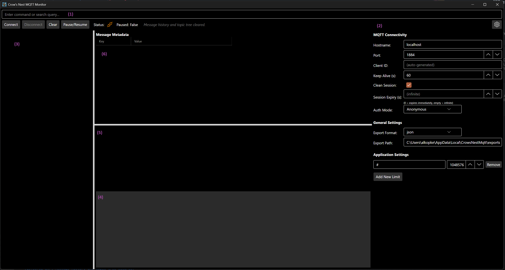
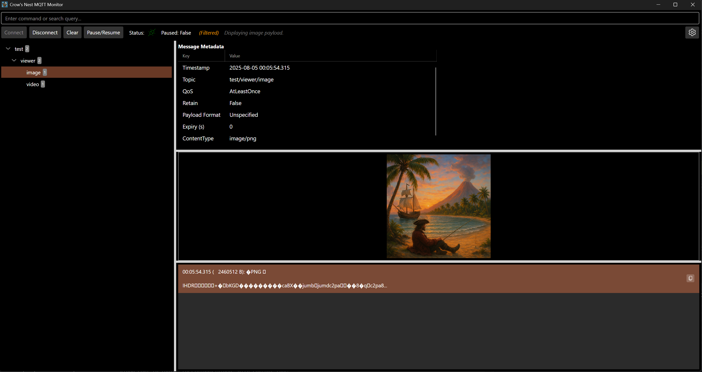
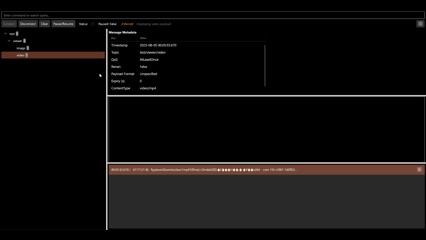
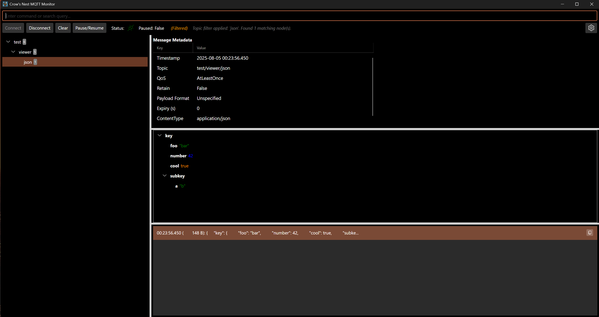
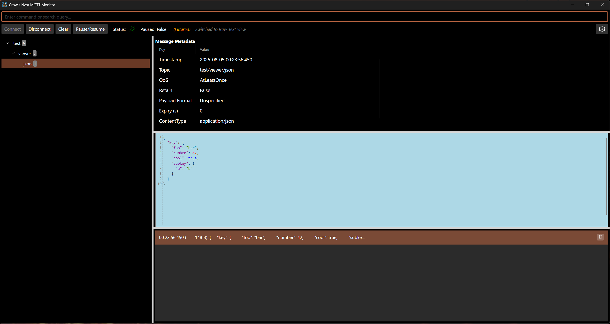
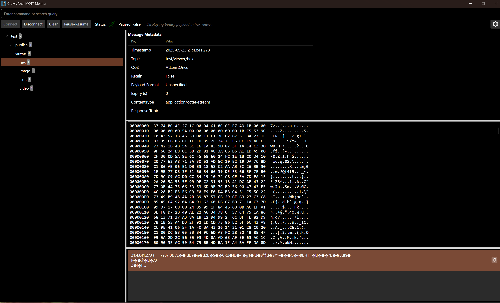
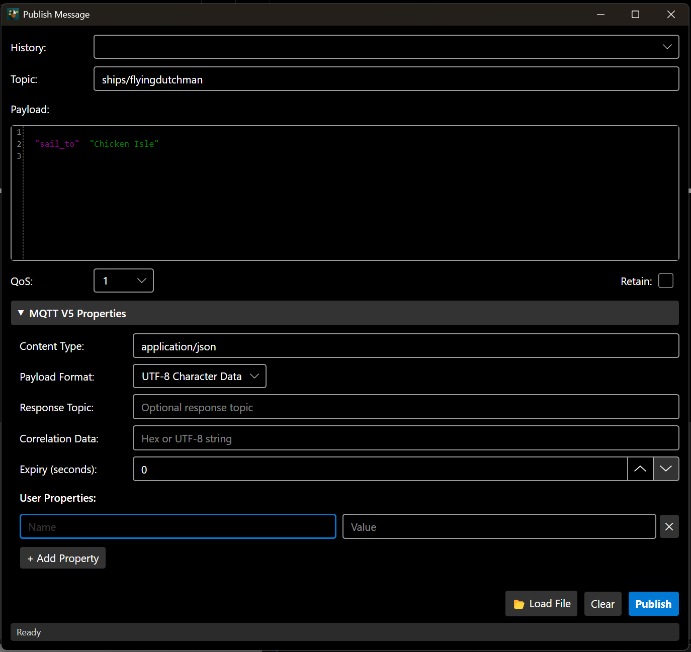
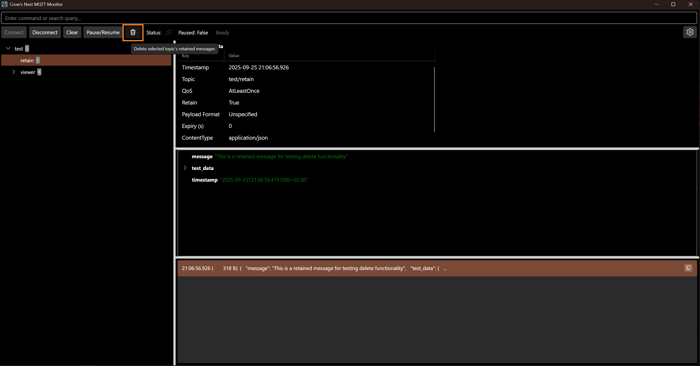
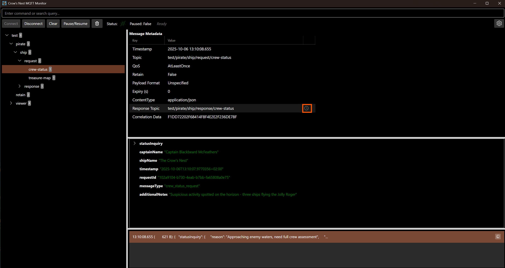
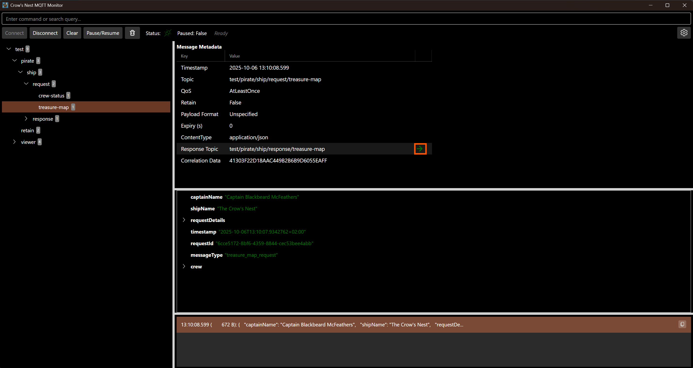

# Crow's NestMQTT

**Crow’s NestMQTT** is a versatile, cross-platform MQTT GUI client designed to simplify and enhance your messaging experience across Linux, Windows, and macOS. With an intuitive, polished interface, it serves as your lookout—monitoring, managing, and troubleshooting MQTT communications with precision and ease.

Whether you're a seasoned developer or a newcomer to IoT, Crow’s NestMQTT provides robust tools for subscribing to topics, and inspecting payloads in real time. The client offers customizable dashboards, seamless connection management, and advanced filtering options, ensuring you can quickly pinpoint critical data streams. Its cross-platform support means that no matter your operating system, you can harness the power of MQTT to orchestrate reliable and secure message flows. Welcome aboard, and let Crow’s NestMQTT guide you through the vast network of your IoT environment!

## Installation

### Microsoft Store (Recommended)
Install from the Microsoft Store for the simplest experience. Packages are automatically signed by Microsoft—no additional setup required.

### Homebrew (macOS)
Install via [Homebrew](https://brew.sh/) using the custom tap:

```bash
brew tap koepalex/crowsnest
brew install --cask crowsnestmqtt
```

To update:
```bash
brew upgrade --cask crowsnestmqtt
```

### GitHub Releases (Sideloading)
Download the `.msixbundle` or platform-specific `.msix` from [GitHub Releases](https://github.com/koepalex/Crow-s-Nest-MQTT/releases). These packages are unsigned, so Windows requires **Developer Mode** to be enabled before installation:

1. Open **Settings → System → For developers**
2. Enable **Developer Mode**
3. Double-click the downloaded `.msixbundle` to install

Alternatively, install via PowerShell:
```powershell
Add-AppxPackage -Path .\CrowsNestMqtt-1.0.0.msixbundle
```

### Linux
Download the platform-specific archive from [GitHub Releases](https://github.com/koepalex/Crow-s-Nest-MQTT/releases) and run the executable directly—no installation step required.

For video playback, install the VLC plugin modules:

```bash
sudo apt install vlc-plugin-base
```

Linux release builds bundle these modules with the application. Developers building a Linux release must install this package before publishing.

Current macOS release artifacts are not yet Apple Developer signed/notarized. If macOS blocks app launch after copying to `/Applications`, use one of these options:

1. In Finder, right-click `CrowsNestMQTT.app` and choose **Open**.
2. If needed, remove quarantine attributes from Terminal:

```bash
xattr -dr com.apple.quarantine /Applications/CrowsNestMQTT.app
```

## Why using it?

* Focused on developer 💻
* Controllable via keyboard shortcuts ⌨️
  * Fast topic search with `/[term]` and navigate with `n`/`N`
  * Navigate message history with `j`/`k` (vim-style)
* MQTT V5 feature rich 📨
  * Shows more than only MQTT message payload
    * metadata like `response-topic`, `correlation-data`, `content-type`  etc.
    * all user properties
  * Supports MQTT V5 enhanced authentication
  * Visual indication of expired messages ⏰
    * Strikethrough and dimmed text in message history for expired messages
    * Yellow warning icon in metadata view for the expiry field
* Supports TLS connection to MQTT Broker 🔐
* Supports WebSocket transport (ws:// and wss://), including HTTP(S) forward proxies 🌐
* Can handle huge amount of MQTT messages 
* Allows filtering of MQTT topics by pattern 🗃️
* Allows searching of pattern within MQTT message payloads 🔍
* Supports copy of MQTT message including metadata 
* Export of MQTT messages  
* `content-type` aware visual representation of MQTT message payload 
  * Json
  * Images
  * Video
  * Hex (for binary data)
* MQTT message publishing
* dotnet Aspire context aware

## Graphical User Interface



The Crow’s NestMQTT graphical interface is organized into several key areas:

**1. Command Plate**
Used to execute commands, as Crow's NestMQTT is designed for developer this is the main interaction mode. For list and description of available commands see [Command Interface section](#command-interface). 

Command Plate can be selected by `Ctrl + Shift + P` keyboard shortcut.

**2. Settings Pane**
Used to configure Crow'S NestMQTT, can be opened/closed by clicking on `Gear` button or using :settings command.

**3. MQTT Topic Tree**
Used to show MQTT topics, where messages are received. Selecting a topic here will set the context for the other panes.

**4. History View**
Shows the history of received messages of the selected topic. Including the received time, the size, a small preview and the possibility to copy the whole message. Selecting a message here will set the context for details and metadata panes.

**5. Payload View**
Shows the payload of the message selected in history view. Supports rendering of JSON payload or shows payload as text. The default viewer is depending on `content-type` of the selected Message. The viewer can be switched by using `:view raw`, `:view json` and `:view image` commands.

**6. Metadata View**
Shows all the metadata of the message selected in history view. Including standard metadata like `correlation-id`, `response-topic` but also custom metadata like `user-properties`. When a message has a non-zero `message-expiry-interval`, the metadata view shows the remaining time or "EXPIRED" status. Expired messages display a yellow warning icon next to the expiry field.

### Settings
**1. Connection Settings**  
Configure how the client connects to your MQTT broker:
- **Hostname**: The broker address (default: `localhost`).
- **Port**: The broker port (default: `1883`).
- **Use TLS**: Enable to connect to the broker using TLS encryption. If enabled, the client will allow untrusted certificates and ignore certificate chain and revocation errors. You can also set this via the `:setusetls <true|false>` command.
- **Transport / WS Path**: Select WebSocket transport and configure its broker path (default: `/mqtt`).
- **WS Proxy / Proxy User / Proxy Password**: Optional HTTP(S) forward proxy settings used only for WebSocket transport.
- **Client ID**: Optional identifier for the client. If left blank, one is generated.
- **Keep Alive Interval**: Time in seconds between keep-alive pings (default: `60`).
- **Clean Session**: If enabled, the broker does not retain session data after disconnect.
- **Session Expiry Interval**: How long (in seconds) the broker should retain session state after disconnect (if Clean Session is off).

**2. Authentication**  
Choose the authentication mode:
- **Anonymous**: No credentials required.
- **Username/Password**: Enter credentials for brokers requiring authentication.
- **Enhanced**: For MQTT 5.0 enhanced authentication, specify:
  - **Authentication Method** (e.g., `SCRAM-SHA-1`, `K8S-SAT`)
  - **Authentication Data** (method-specific data)
- **Azure**: For Azure Event Grid namespace MQTT brokers. Uses
  `Azure.Identity.DefaultAzureCredential` (env vars → managed identity → Visual
  Studio → `az login` → interactive browser) to obtain an Entra ID access
  token. The token is sent via MQTT v5 enhanced authentication using method
  `OAUTH2-JWT` and is **automatically refreshed before it expires** without
  reconnecting. Selecting Azure auto-enables TLS, port `8883`, and TCP
  transport. The default OAuth scope is `https://eventgrid.azure.net/.default`
  but can be overridden in the **OAuth Scope** field.

**3. Export Options**  
Control how and where message logs are exported:
- **Export Format**: Choose between JSON or plain text.
- **Export Path**: Directory for exported files.

**4. Topic Buffer Limits**  
Set per-topic message buffer limits to manage memory usage:
- **Topic Filter**: MQTT topic or wildcard (e.g., `#` for all topics).
- **Max Size (Bytes)**: Maximum buffer size for each topic.

### Viewers
Crow's NestMQTT automatically render content of MQTT message as image when the content-type indicates an image


or plays a video when the content-type indicates one  


or renders a JSON object when the content-type is set to `application/json`  


if the special viewer can't be applied the default content viewer is used  


If the content-type indicates binary data (but not image/video), Crow's NestMQTT will automatically show the payload in a read-only hex viewer:


You can switch between viewers for the currently selected MQTT message using the `:view` command.

### Publishing
Crow's NestMQTT allows publishing of MQTT messages, the publishing dialog (can be toggled via `Ctrl+Shift+M`) allows defining the payload, configuring message metadata as well as setting user-properties.  
You can also choose to select a file for publishing instead (which will fillout some metadata like content-type automatically). As pirates take everything and give nothing back, all send messages are stored locally to easily send them again.



### Other Features
Crow's NestMQTT has some advanced features to make the life of the pirate that sail on the MQTT bit sea easier such as.

Delete Topics allow remove retain messages from selected topics


Crow's NestMQTT understand MQTT V5 request/response, each request message shows a small clock icon while waiting for the related response message.


Once the response message is received (first message send to given response topic that has the same correlation data), and clickable arrow icon allows jumping direct to the response.


Messages with MQTT V5 `message-expiry-interval` are visually marked when they expire: the message history shows them with strikethrough text and dimmed foreground, while the metadata view displays a yellow warning triangle icon next to the expiry field with the "EXPIRED" status.

Using the `:stats` commands opens a non modal dialog, that shows MQTT message statistics per MQTT topic.


## Command Interface

Crow's Nest MQTT provides a command interface (likely accessible via a dedicated input field) for quick actions. Commands are typically prefixed with a colon (`:`). You can quickly access this input field using the `Ctrl + Shift + P` keyboard shortcut.

*   `:connect [<server:port>] [<username>] [<password>]` - Connect to an MQTT broker. If arguments are omitted, connection details are loaded from settings. Supports WebSocket URIs: `:connect ws://host:port/path` or `:connect wss://host:port/path`.
*   `:disconnect` - Disconnect from the current MQTT broker.
*   `:export <json|txt> <filepath>` - Export messages to a file in JSON or plain text format. If arguments are omitted, the path and format are loaded from settings.
*   `:export all` - Export all messages from the currently selected topic to a single JSON file in the configured export path. The file contains an array of all messages from that topic.
*   `:filter [regex_pattern]` - Filter messages based on a regex pattern. Clears the filter if no pattern is provided.
*   `/[search_term]` - Search for topics containing the search term (case-insensitive). Use `n` to navigate to the next match and `N` (Shift+n) to navigate to the previous match. The topic tree automatically expands to show the selected topic.
*   `:clear` - Clear all messages from the display.
*   `:help [command]` - Show information about available commands.
*   `:copy` - Copy the selected messages to the clipboard.
*   `:pause` - Pause the display of new messages.
*   `:resume` - Resume the display of new messages.
*   `:expand` - Expand all nodes in the topic tree.
*   `:collapse` - Collapse all nodes in the topic tree.
*   `:deletetopic [<topic>]` - Removes all retain messages to a given topic (and subtopics)
*   `:gotoresponse` - Navigate to the response message for the currently selected MQTT v5 request message (if a response has been received)
*   `:view <raw|json|image|video|hex>` - Set the payload view to raw text, formatted JSON tree, image, video, or hex viewer. The hex viewer displays binary payloads in a classic hex+ASCII table.
*   `:settings` - Toggle the visibility of the settings panel.
*   `:setuser <username>` - Set the username for MQTT authentication.
*   `:setpass <password>` - Set the password for MQTT authentication.
*   `:setauthmode <anonymous|userpass|enhanced|azure>` - Set the authentication mode. Use `azure` to connect to Azure Event Grid namespaces with Entra ID tokens via `DefaultAzureCredential`.
*   `:setauthmethod <method>` - Set the *enhanced-auth* method name (e.g., `SCRAM-SHA-1`, `K8S-SAT`). Applied only when the auth mode is `enhanced`. **Note:** this is distinct from `:setauthmode`; passing `anonymous`/`userpass`/`enhanced`/`azure` here is rejected because it's a common typo caused by the palette autocomplete.
*   `:setauthdata <data>` - Set the authentication data for enhanced authentication (method-specific data).
*   `:setauthscope <scope>` - Set the OAuth scope requested when Azure authentication mode is active. Defaults to `https://eventgrid.azure.net/.default`.
*   `:setclientid [<client-id>]` - Set the MQTT Client ID (required for Azure Event Grid, must match a registered Client resource on the namespace). Omit the argument to clear.
*   `:setsubscription [<topic-filter>]` - Set the MQTT topic filter for the client's initial subscription. Defaults to `#`. Azure Event Grid rejects `#`; use a filter that matches your Topic Space template (e.g. `sensors/#`). Omit the argument to reset to `#`.
*   `:azurewhoami` - Print the identity (`upn`, `oid`, `name`, `appid`, `tenant`) that `DefaultAzureCredential` will use for Azure Event Grid. Use the values it prints to configure the `authenticationName` on the Event Grid Client resource.
*   `:setusetls <true|false>` - Set whether to use TLS for the MQTT connection. When set to `true`, the client will connect using TLS, allow untrusted certificates, and ignore certificate errors.
*   `:setproxy [<http[s]://host:port> [<username> [<password>]]]` - Configure the forward proxy used for WebSocket transport. Omit all arguments to clear it, and reconnect after changing it. A dedicated command is used instead of extending `:connect` because proxy configuration is transport-level state that should persist across broker reconnects and remain separate from MQTT broker credentials.
*   `:publish [topic] [@file|text]` - Open the publish window. Optionally pre-fill the topic (defaults to the selected topic) and payload from a file (`@path/to/file`) or inline text. The publish window is non-modal and supports all MQTT V5 properties.
*   `:stats` - Open a non-modal window showing per-topic statistics (message count, total payload size, average payload size, mean time between messages) for every topic that has received a message. The counters are lifetime totals — they are not affected by ring-buffer eviction and only reset on `:clear`. The table is sortable, updates once per second, and can be copied as a GitHub-flavored Markdown table via the *Copy as Markdown* button (or `Ctrl+C`).
*   `[search_term]` - Any text entered without a `:` prefix is treated as a search term to filter messages.

## Keyboard Navigation Shortcuts

Crow's NestMQTT provides vim-inspired keyboard shortcuts for efficient navigation without leaving the keyboard:

### Topic Search Navigation
*   **`/[search_term]`** - Search for topics containing the term (case-insensitive). Automatically selects the first match and expands the topic tree to show it.
*   **`n`** - Navigate to the next search result. Wraps around to the first match when reaching the end.
*   **`N`** (Shift+n) - Navigate to the previous search result. Wraps around to the last match when at the beginning.

The search status is displayed in the status bar showing the current match position (e.g., "Search: 'sensor' (match 2 of 5)").

### Message History Navigation
*   **`j`** - Move down to the next message in the history view. Wraps to the first message when at the end.
*   **`k`** - Move up to the previous message in the history view. Wraps to the last message when at the beginning.

### Other Shortcuts
*   **`Ctrl + Shift + P`** - Open the command palette to quickly access any command.
*   **`Ctrl + Shift + M`** - Toggle the publish window.
*   **`Alt + P`** - Send/publish message (when publish window is focused).
*   **`Ctrl + Enter`** - Alternative send shortcut (when publish window editor is focused).
*   **`Escape`** - Close the publish window.

**Note:** Keyboard shortcuts are automatically disabled when typing in the command palette to prevent interference with normal text input.

## Enhanced Authentication

Crow's Nest MQTT supports Enhanced Authentication, as defined in the MQTT 5.0 specification. This allows for more advanced authentication mechanisms, such as Challenge/Response Authentication.

To use Enhanced Authentication, you need to configure the following settings:

*   **`AuthenticationMethod`**: The name of the authentication method (e.g., `SCRAM-SHA-1`, `K8S-SAT`).
*   **`AuthenticationData`**: The authentication data, which is specific to the chosen authentication method.

You can set the authentication mode to `enhanced` using the `:setauthmode` command:

```
:setauthmode enhanced
:setauthmethod ABC
:setauthdata CAFE
```

When connecting to a broker with Enhanced Authentication, the client and broker will exchange authentication data until the authentication process is complete.

## Azure Event Grid Namespace (OAUTH2-JWT)

Crow's NestMQTT can connect to **Azure Event Grid namespace** MQTT brokers using Entra ID
(Microsoft Azure Active Directory) tokens. No certificates or shared keys are required —
the client uses `Azure.Identity.DefaultAzureCredential` to acquire an access token via
the standard Azure credential chain (env vars → managed identity → Visual Studio →
`az login` → interactive browser).

**To connect:**

```
:setauthmode azure
:connect mynamespace.eastus-1.ts.eventgrid.azure.net:8883
```

`:connect` automatically detects Azure Event Grid hostnames (suffix
`.ts.eventgrid.azure.net`) and switches to Azure auth mode if needed. Selecting Azure
auth mode also auto-configures TLS, port `8883`, and TCP transport.

**Custom OAuth scope:** the default scope is `https://eventgrid.azure.net/.default`.
Override with `:setauthscope <scope>` if your tenant requires a different audience.

**Token refresh:** Entra ID tokens expire (typically ~1h). Crow's NestMQTT schedules a
proactive refresh 5 minutes before expiry and sends a new token via an MQTT v5 `AUTH`
packet, so long-running sessions stay connected without reconnect.

**Authentication on the client machine:**

| Scenario | Recommended setup |
|---|---|
| Local development | `az login` |
| CI / containers | `AZURE_CLIENT_ID` + `AZURE_TENANT_ID` + `AZURE_CLIENT_SECRET` env vars (workload identity / service principal) |
| Azure VM / Container App | Use the host's managed identity (no extra config needed) |

### Local development / Aspire testing (no Azure required)

The repository ships a `MockAzureEventGridBroker` project under `tools/` that emulates
an Event Grid namespace listener locally: it accepts CONNECT packets whose
`AuthenticationMethod` is `OAUTH2-JWT` and whose `AuthenticationData` is a
well-formed JWT (signatures are not verified). The bundled Aspire host launches
this mock broker alongside a fourth Crow's Nest instance (`crows-nest-mqtt-azure`)
so you can exercise the full Azure code path with `dotnet run --project src/AppHost`
without deploying to Azure.

To bypass `DefaultAzureCredential` and use a hand-issued JWT, set the
`CROWSNEST__AZURE_TOKEN_OVERRIDE` environment variable to the token string. When
present, `AzureAccessTokenProvider` returns the override directly and the JWT's
`exp` claim drives the refresh timer (fallback: 1 hour). The Aspire host wires
this automatically for the fourth instance — you do not need to set it manually
when running the AppHost.

> ⚠️ **Do not set `CROWSNEST__AZURE_TOKEN_OVERRIDE` in production.** It short-circuits
> Entra ID entirely and will forward whatever token you provide to the broker.

Automated coverage lives in `tests/AppHost.Tests/AzureAuthModeAspireTests.cs`:

```
dotnet test tests/AppHost.Tests/AppHost.Tests.csproj --configuration Release
```

The tests spawn the mock broker as a child process, connect a real MQTTnet v5
client with OAUTH2-JWT, and assert that: (1) valid tokens are accepted, (2)
CONNECTs without an `OAUTH2-JWT` method are rejected, and (3) client-initiated
MQTT v5 `AUTH` re-authentication packets are received by the broker.

### Troubleshooting Azure Event Grid connections

If your `Azure` auth-mode connection is stuck in a reconnect loop with
`NotAuthorized` in the status bar, work through these three checks in order —
they cover the vast majority of setup issues.

**1. Hostname must be the MQTT topic-space FQDN, not the HTTP Data Plane URL.**

| ❌ Wrong (HTTP Data Plane) | ✅ Correct (MQTT topic space) |
|---|---|
| `https://mynamespace.northeurope-1.eventgrid.azure.net/api/events` | `mynamespace.northeurope-1.ts.eventgrid.azure.net` |

The Azure portal shows both URLs in different blades. For MQTT you need the one
with the **`.ts.`** infix, no scheme, and no path. The client auto-corrects
common mistakes: pasting the HTTP URL strips `https://` / `/api/events` and
rewrites the suffix on the fly, showing a status-bar note when it does.

**2. Client ID must match a registered client on the namespace.**

Azure Event Grid's MQTT broker maps the CONNECT packet's `Client ID` field to
one of its Client resources (or a Client Authentication Name attribute rule).
An empty / auto-generated GUID will be rejected. Set the Client ID via the
settings pane or `:setclientid <name>` to the `name` of your Event Grid client
resource, or to a value that matches your attribute rule.

To figure out **which identity** to register the client for, run:

```
:azurewhoami
```

That command decodes the token `DefaultAzureCredential` would use and prints
its `upn`, `oid`, `name`, `appid`, and `tenant` claims. Register an Event Grid
Client whose **Client authentication name** matches your `oid` (Object ID is
the most stable choice) or `upn`, then set the MQTT Client ID field to that
client's `name`:

```powershell
$myOid = az ad signed-in-user show --query id -o tsv
az eventgrid namespace client create `
  --resource-group <rg> `
  --namespace-name <namespace> `
  --client-name my-cli-user `
  --authentication-name $myOid `
  --state Enabled
```

Then in Crow's Nest: `:setclientid my-cli-user`.

**3. The signed-in identity needs an Event Grid RBAC role.**

`DefaultAzureCredential` gets a token for whoever is signed in via `az login`,
Visual Studio, managed identity, or an `AZURE_CLIENT_ID`+`AZURE_CLIENT_SECRET`
env-var pair. That identity must have one of these roles on the namespace or
topic-space:

- `EventGrid TopicSpaces Publisher`
- `EventGrid TopicSpaces Subscriber`

Assign the role via `az role assignment create` or the portal's IAM blade. See
the [Event Grid MQTT client auth docs](https://learn.microsoft.com/azure/event-grid/mqtt-client-authentication)
for details.

**4. Subscription filter must fit inside your Topic Space template.**

After a successful CONNECT the client fires a single SUBSCRIBE. The default
filter is `#` (all topics), which is what open brokers like EMQX or Mosquitto
accept. **Azure Event Grid always rejects `#`** — the SUBACK carries
`NotAuthorized` — because the filter has to be matched by a Permission Binding
whose Topic Space template covers it. Set a narrower filter that fits your
namespace's Topic Space:

```
:setsubscription sensors/#
```

or a specific topic template like `devices/+/telemetry`. Then reconnect. The
subscription topic is also visible in the settings pane ("Subscription Topic")
and is persisted to `settings.json`.

**Other gotchas**

- `Keep Alive` below ~30 seconds is rejected; the client bumps it to 30
  automatically when you switch to Azure mode.
- `Session Expiry` below 5 minutes with `Clean Session=true` causes the session
  to expire before the first reconnect; the client bumps it to 3600 automatically.
- `Use TLS` **must** be checked; Event Grid only accepts TLS on port 8883.

## dotnet Aspire

Crow's NestMQTT automatically connects to the MQTT Broker endpoint defined via dotnet Aspire environment variables. It supports both `services__mqtt__mqtt__0` and `services__mqtt__default__0` naming conventions. The endpoint URI scheme determines the transport protocol:

- `mqtt://localhost:1883` → TCP connection
- `ws://localhost:8083/mqtt` → WebSocket connection
- `wss://localhost:8084/mqtt` → Secure WebSocket connection (TLS)

When an Aspire endpoint environment variable is detected, the application:
1. Parses the hostname and port from the URI
2. Overrides the corresponding settings
3. Automatically connects to the broker on startup
4. Persists the overridden values to `settings.json` so other tools can use them

The repository AppHost also starts an `ubuntu/squid` forward proxy and a
`crows-nest-mqtt-ws-proxy` application instance. That instance connects to the
EMQX WebSocket listener through Squid, so proxy behavior can be exercised from
the Aspire dashboard without additional setup. The AppHost mounts
`src/AppHost/squid/crowsnest.conf`, which permits HTTP CONNECT tunneling to the
EMQX WebSocket listener on port `8083`.

```csharp
  // ...
  var mqttViewerWorkingDirectory = @"S:\upertools\CrowsNestMqtt";
  builder
      .AddExecutable("mqtt-client", Path.Combine(mqttViewerWorkingDirectory, "CrowsNestMqtt.App.exe"), mqttViewerWorkingDirectory)
      .WithReference(mqttBrokerEndpoint)
      .WaitFor(mqttBroker);
```

## Environment Variable Configuration

All settings can be configured via environment variables using the `CROWSNEST__` prefix. When environment variable overrides are detected, they are applied on top of file-based settings and **persisted to `settings.json`** so other tools (e.g., `SendTestData.ps1`) can use the same configuration.

This is useful for:
- Running from dotnet Aspire (settings won't be overwritten)
- Running integration tests with specific configuration
- CI/CD environments
- Docker containers

### Available Environment Variables

| Variable | Description | Type | Example |
|---|---|---|---|
| `services__mqtt__mqtt__0` | Aspire MQTT endpoint (triggers auto-connect) | URI | `mqtt://localhost:1883` |
| `services__mqtt__default__0` | Aspire MQTT endpoint (alternative name) | URI | `mqtt://broker:8883` |
| `CROWSNEST__HOSTNAME` | MQTT broker hostname | string | `mqtt.example.com` |
| `CROWSNEST__PORT` | MQTT broker port | int | `8883` |
| `CROWSNEST__CLIENT_ID` | MQTT client ID | string | `my-client` |
| `CROWSNEST__KEEP_ALIVE_SECONDS` | Keep-alive interval in seconds | int | `30` |
| `CROWSNEST__CLEAN_SESSION` | Whether to use clean session | bool | `true` |
| `CROWSNEST__SESSION_EXPIRY_SECONDS` | Session expiry interval | uint | `300` |
| `CROWSNEST__AUTH_MODE` | Authentication mode | enum | `anonymous`, `userpass`, `enhanced`, `azure` |
| `CROWSNEST__AUTH_USERNAME` | Username (when AUTH_MODE=userpass) | string | `myuser` |
| `CROWSNEST__AUTH_PASSWORD` | Password (when AUTH_MODE=userpass) | string | `mypass` |
| `CROWSNEST__AUTH_METHOD` | Enhanced auth method (when AUTH_MODE=enhanced) | string | `SCRAM-SHA-1` |
| `CROWSNEST__AUTH_DATA` | Enhanced auth data (when AUTH_MODE=enhanced) | string | |
| `CROWSNEST__AUTH_SCOPE` | OAuth scope (when AUTH_MODE=azure) | string | `https://eventgrid.azure.net/.default` |
| `CROWSNEST__USE_TLS` | Enable TLS encryption | bool | `true` |
| `CROWSNEST__TRANSPORT` | Transport protocol | enum | `Tcp`, `WebSocket` |
| `CROWSNEST__WEBSOCKET_PATH` | WebSocket path (when TRANSPORT=WebSocket) | string | `/mqtt` |
| `CROWSNEST__WEBSOCKET_PROXY_ADDRESS` | HTTP(S) forward proxy used for WebSocket transport | URI | `http://proxy.example.com:3128` |
| `CROWSNEST__WEBSOCKET_PROXY_USERNAME` | Optional proxy username | string | `proxy-user` |
| `CROWSNEST__WEBSOCKET_PROXY_PASSWORD` | Optional proxy password | string | `proxy-password` |
| `CROWSNEST__SUBSCRIPTION_QOS` | Subscription QoS level (0, 1, or 2) | int | `1` |
| `CROWSNEST__EXPORT_FORMAT` | Default export format | enum | `json`, `txt` |
| `CROWSNEST__EXPORT_PATH` | Default export file path | string | `/tmp/exports` |
| `CROWSNEST__MAX_TOPIC_LIMIT` | Max topics for delete operations | int | `500` |
| `CROWSNEST__PARALLELISM_DEGREE` | Parallelism for batch operations | int | `4` |
| `CROWSNEST__TIMEOUT_SECONDS` | Operation timeout in seconds | int | `5` |
| `CROWSNEST__DEFAULT_BUFFER_SIZE_BYTES` | Default per-topic buffer size | long | `1048576` |
| `CROWSNEST__TOPIC_BUFFER_LIMITS` | Per-topic buffer limits (JSON array) | JSON | `[{"TopicFilter":"#","MaxSizeBytes":2097152}]` |

### Priority

1. `CROWSNEST__HOSTNAME` / `CROWSNEST__PORT` take highest priority for connection settings
2. Aspire endpoint env vars (`services__mqtt__mqtt__0`, `services__mqtt__default__0`) are used as fallback for hostname/port
3. File-based `settings.json` is the lowest priority (used when no env vars are set)

### Example: Aspire Integration

```bash
# Set by Aspire automatically:
services__mqtt__mqtt__0=mqtt://localhost:41883

# Or for WebSocket transport:
services__mqtt__default__0=ws://localhost:8083/mqtt
```

### Example: WebSocket Configuration

```bash
# Connect via WebSocket
export CROWSNEST__HOSTNAME=broker.example.com
export CROWSNEST__PORT=8083
export CROWSNEST__TRANSPORT=WebSocket
export CROWSNEST__WEBSOCKET_PATH=/mqtt

# Or via secure WebSocket
export CROWSNEST__HOSTNAME=broker.example.com
export CROWSNEST__PORT=8084
export CROWSNEST__TRANSPORT=WebSocket
export CROWSNEST__USE_TLS=true
export CROWSNEST__WEBSOCKET_PATH=/mqtt
```

### Example: WebSocket Through a Forward Proxy

```bash
export CROWSNEST__HOSTNAME=broker.example.com
export CROWSNEST__PORT=8083
export CROWSNEST__TRANSPORT=WebSocket
export CROWSNEST__WEBSOCKET_PATH=/mqtt
export CROWSNEST__WEBSOCKET_PROXY_ADDRESS=http://proxy.example.com:3128

# Optional proxy authentication:
export CROWSNEST__WEBSOCKET_PROXY_USERNAME=proxy-user
export CROWSNEST__WEBSOCKET_PROXY_PASSWORD=proxy-password
```

### Example: Manual Configuration

```bash
# Override all connection settings
export CROWSNEST__HOSTNAME=mqtt.production.com
export CROWSNEST__PORT=8883
export CROWSNEST__USE_TLS=true
export CROWSNEST__AUTH_MODE=userpass
export CROWSNEST__AUTH_USERNAME=svc-account
export CROWSNEST__AUTH_PASSWORD=secret
export CROWSNEST__CLIENT_ID=monitoring-client
export CROWSNEST__KEEP_ALIVE_SECONDS=60
```

## Scripts

The `tools/` directory contains utility scripts for working with exported MQTT data.

### extract-payloads.ps1

A PowerShell script that extracts and formats the `Payload` property from exported JSON files.

**Purpose:**  
When messages are exported using `:export all`, each file contains the complete MQTT message structure including metadata. The payload itself is stored as a JSON string within the `Payload` property. This script parses each exported JSON file, extracts the payload, and saves it as a properly formatted, readable JSON file.

**Usage:**
```powershell
cd tools
.\extract-payloads.ps1
```

**Behavior:**
- Processes all `*.json` files in the script's directory
- Skips files that have already been extracted (files ending with `_extracted.json`)
- For each file with a `Payload` property, creates a new file named `<original>_extracted.json`
- The extracted JSON is properly indented for readability
- Files without a `Payload` property are skipped with a warning

**Example:**  
If you have an exported file `sensor_temperature.json` containing:
```json
{
  "Topic": "sensor/temperature",
  "Payload": "{\"value\":23.5,\"unit\":\"celsius\"}",
  "ContentType": "application/json"
}
```

Running the script creates `sensor_temperature_extracted.json` with:
```json
{
  "value": 23.5,
  "unit": "celsius"
}
```
